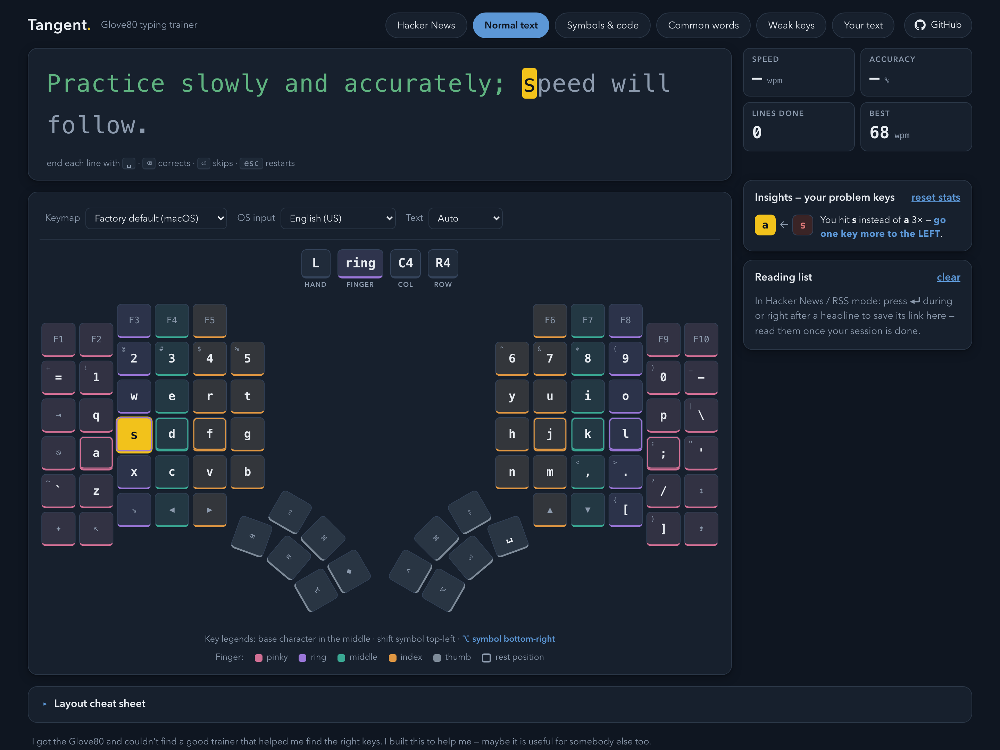

# Tangent — a Glove80 typing trainer

A typing trainer built for the [MoErgo Glove80](https://www.moergo.com/) split ergonomic keyboard. Practise your layout with an on-screen Glove80 that shows exactly **which key and which finger** to use, drawn from the keyboard's real physical geometry.

**Try it: [tangent-trainer.pages.dev](https://tangent-trainer.pages.dev/)** — it's a single HTML file, no build, no server, no tracking. Everything runs locally in your browser; the only network calls fetch headlines (Hacker News mode uses the public [Algolia HN API](https://hn.algolia.com/api), and custom RSS feeds fall back to rss2json.com when the feed doesn't send CORS headers).

[Watch the 1-minute demo](tangent-demo.mp4) — going from hunting for keys at 20 wpm to 70 wpm, in Hacker News mode.

## Features

- **Accurate Glove80 board** — key positions, column stagger, and the rotated thumb-cluster fans are transcribed from MoErgo's ZMK firmware (`glove80-layouts.dtsi`), so the on-screen board matches the Layout Editor and the physical keyboard exactly.
- **Finger guidance** — every key is colour-coded by finger (pinky/ring/middle/index/thumb), and the hint bar tells you hand, finger, and key position for the next character.
- **Official coordinates** — keys are named with MoErgo's C1–C6 / R1–R6 / T1–T6 convention, the same one used in the [Glove80 user guide](https://docs.moergo.com/glove80-user-guide/).
- **Import your own keymap** — drop in a MoErgo Layout Editor JSON export or a ZMK `.keymap` file. The OS input source (e.g. Swedish, German) is auto-detected from the export's locale.
- **International layouts** — Swedish, Norwegian, Danish, German, French, Spanish, US and UK English input sources, with dead-key support (´ ¨ ^ ~) and an **åäö / üöäß / éèçàù focus mode** derived from the keys of your layout.
- **Typing drills with a point** — type real Hacker News headlines or any RSS/Atom feed; press ⏎ to save an interesting headline to a reading list for after the session.
- **Weak-keys mode** — the trainer tracks which keys you miss and what you hit instead, explains the correction ("two keys more to the RIGHT, holding ⇧"), and generates drills targeting exactly those keys.
- **Your own text** — paste any text, or use the built-in LLM prompt to generate practice lines in your language that work in your weak keys.
- Speed (WPM), accuracy, and per-mode personal bests, stored locally.

## Usage

Open `index.html` in a browser (or use the hosted page above). Click the card, start typing. End each line with <kbd>space</kbd>; <kbd>⌫</kbd> corrects; <kbd>esc</kbd> rerolls the line.

Pick your **Keymap** (QWERTY factory default, Colemak, Colemak-DH, Dvorak, Workman, or an imported file), your **OS input** source, and optionally a **Text** language for the generated lines.

## Keywords

Glove80 typing trainer · MoErgo Glove80 practice · learn Glove80 keymap · ZMK keymap trainer · split ergonomic keyboard typing practice · Swedish åäö typing practice · Layout Editor import

## License

[MIT](LICENSE)
